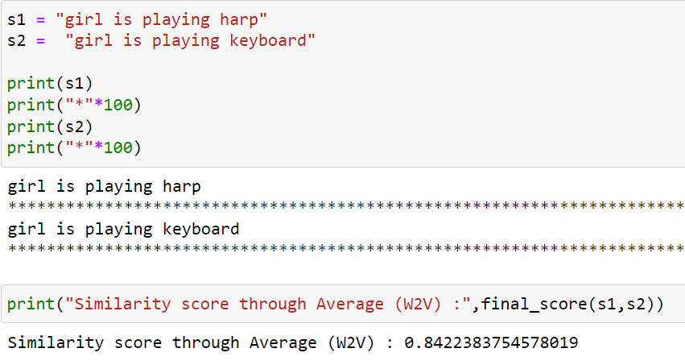

# Sentence Similarity

This project uses the Sentence Transformer, pre-trained on the model 
**bert-base-nli-mean-tokens**  for sentence embedding and uses custom defined 
cosine similarity function to return similarity score.


## Acknowledgements

 - [Documentation](https://www.sbert.net/)
 - [Research paper](https://arxiv.org/abs/1908.10084)
 


## API Reference

#### Get the framework for sentence embedding.

```http
  pip install -U sentence-transformers
```

## Demo


Here, a simple working of the model is shown. The model is deployed using
flask api.

We as humans know these sentences are same. The model is also
able to interpret this and thus gives a high similarity score of **(0.986)**.


Here, these two sentences mean totally different things and hence the low similarity score of **(0.199)**


## Approach

I have employed 2 methods to see which gives better results.

1. Average Word2Vec:
Here, I have used the Word2Vec model which is pretrained on Google
news data. Each word embedding is of **300 dimensions** and vector-average of these
word embedding is taken to form the Vector which represents the entire sentence.

Below, is a snapshot of the defined function:


2. Sentence Transformer:

This also uses a pretrained model to get the sentence embedding.
The vector for each word is of **768 dimensions** and similarly mean of all the word embedding is taken to
get the final vector for the sentence. The framework is based on PyTorch and Transformers
and offers a collection of pretrained models to work with.  The models are based on transformer networks like BERT / RoBERTa / XLM-RoBERTa.

Below, we see how to use this:


3. Cosine similarity:

Given two vectors, this function calculates how similar they are by providing
a score in the range [0-1]. Higher this value, more similar are the given vectors.

Here's a snapshot of the function:


## Results

The Sentence Transformers carry much more essence of the text than the Average W2V
and hence the API is build around the former method. Below is a screenshot
of how Sentence Transformer gives better results than Average W2V.




The Average W2V gives higher similarity score and gives a false representation
that the two sentences are similar when infact they are not. 
